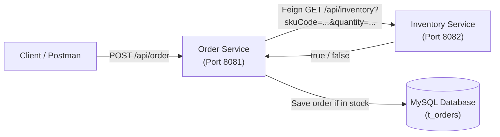

# 📋 KẾ HOẠCH TRIỂN KHAI & DANH SÁCH TASK CHI TIẾT
## Part 2: Giao tiếp đồng bộ với OpenFeign (Order Service ↔ Inventory Service) & Integration Test với WireMock

> **Căn cứ tài liệu:** [`Part2_OpenFegin.md`](file:///D:/MSS301/repo/slot6/Part2_OpenFegin.md) và [`Part2_OpenFegin_Guide.md`](file:///D:/MSS301/repo/slot6/Part2_OpenFegin_Guide.md)

---

## 🎯 Tổng quan kiến trúc & Mục tiêu



---

## 📌 GIAI ĐOẠN 0: Chuẩn Bị & Thiết Lập Môi Trường (Prerequisites)

- [ ] **Task 0.1: Copy mã nguồn từ Part 1 sang workspace `slot6`**
  - **Mục tiêu:** Kéo đầy đủ 2 service từ bài lab trước sang thư mục hiện tại.
  - **Các folder cần có:**
    - `d:\MSS301\repo\slot6\order-service\`
    - `d:\MSS301\repo\slot6\inventory-service\`
  - **Tiêu chí nghiệm thu:** Root thư mục `slot6` nhìn thấy 2 thư mục con chứa đầy đủ `pom.xml` và mã nguồn `src/`.

- [ ] **Task 0.2: Khởi động cơ sở dữ liệu MySQL**
  - **Mục tiêu:** Đảm bảo database MySQL đang chạy để cả 2 service kết nối.
  - **Thực hiện:**
    ```bash
    cd d:\MSS301\repo\slot6\order-service
    docker compose up -d mysql
    ```
  - **Tiêu chí nghiệm thu:** `docker ps` hiển thị container mysql đang chạy và sẵn sàng nhận kết nối trên port 3306.

---

## 📌 GIAI ĐOẠN 1: Cài Đặt OpenFeign Vào `order-service`

### Task 1.1: Cấu hình Maven Dependencies & Spring Cloud BOM
- **File tác động:** `order-service/pom.xml`
- **Chi tiết thực hiện:**
  1. Thêm property version trong `<properties>`:
     ```xml
     <spring-cloud.version>2023.0.3</spring-cloud.version>
     ```
  2. Thêm `<dependencyManagement>` (Bill of Materials) để quản lý đồng bộ version Spring Cloud:
     ```xml
     <dependencyManagement>
         <dependencies>
             <dependency>
                 <groupId>org.springframework.cloud</groupId>
                 <artifactId>spring-cloud-dependencies</artifactId>
                 <version>${spring-cloud.version}</version>
                 <type>pom</type>
                 <scope>import</scope>
             </dependency>
         </dependencies>
     </dependencyManagement>
     ```
  3. Thêm dependency OpenFeign vào khối `<dependencies>`:
     ```xml
     <dependency>
         <groupId>org.springframework.cloud</groupId>
         <artifactId>spring-cloud-starter-openfeign</artifactId>
     </dependency>
     ```
- **Kiểm chứng:** Chạy `mvn clean compile` tải về thư viện thành công không lỗi syntax XML.

---

### Task 1.2: Tạo FeignClient Interface cho Inventory Service
- **File tạo mới:** `order-service/src/main/java/com/fudn/orderservice/client/InventoryClient.java`
- **Package:** `com.fudn.orderservice.client`
- **Chi tiết thực hiện:**
  ```java
  package com.fudn.orderservice.client;

  import org.springframework.cloud.openfeign.FeignClient;
  import org.springframework.web.bind.annotation.RequestMapping;
  import org.springframework.web.bind.annotation.RequestMethod;
  import org.springframework.web.bind.annotation.RequestParam;

  @FeignClient(value = "inventory", url = "${inventory.url}")
  public interface InventoryClient {

      @RequestMapping(method = RequestMethod.GET, value = "/api/inventory")
      boolean isInStock(@RequestParam("skuCode") String skuCode, @RequestParam("quantity") Integer quantity);
  }
  ```
- **Kiểm chứng:** Interface compile không lỗi, tham số mapping đúng với endpoint bên `inventory-service`.

---

### Task 1.3: Cấu hình URL endpoint tồn kho
- **File tác động:** `order-service/src/main/resources/application.properties`
- **Chi tiết thực hiện:** Thêm cấu hình trỏ tới cổng của Inventory Service:
  ```properties
  inventory.url=http://localhost:8082
  ```
- **Kiểm chứng:** Giá trị property được Spring Boot nhận diện khi inject vào `@FeignClient(url = "${inventory.url}")`.

---

### Task 1.4: Tích hợp FeignClient vào Business Logic
- **File tác động:** `order-service/src/main/java/com/fudn/orderservice/service/OrderService.java`
- **Chi tiết thực hiện:**
  1. Khai báo field `private final InventoryClient inventoryClient;` (được inject tự động qua `@RequiredArgsConstructor`).
  2. Cập nhật method `placeOrder(OrderRequest orderRequest)`:
     ```java
     public void placeOrder(OrderRequest orderRequest) {
         boolean inStock = inventoryClient.isInStock(
                 orderRequest.skuCode(),
                 orderRequest.quantity());

         if (inStock) {
             var order = mapToOrder(orderRequest);
             orderRepository.save(order);
         } else {
             throw new RuntimeException(
                     "Product with Skucode " + orderRequest.skuCode() + " is not in stock");
         }
     }
     ```
- **Kiểm chứng:** Logic có transaction `@Transactional`, throw `RuntimeException` nếu tồn kho không đủ để đảm bảo rollback.

---

### Task 1.5: Bật Feign Client trên Main Application Class
- **File tác động:** `order-service/src/main/java/com/fudn/orderservice/OrderServiceApplication.java`
- **Chi tiết thực hiện:** Thêm annotation `@EnableFeignClients`:
  ```java
  package com.fudn.orderservice;

  import org.springframework.boot.SpringApplication;
  import org.springframework.boot.autoconfigure.SpringBootApplication;
  import org.springframework.cloud.openfeign.EnableFeignClients;

  @SpringBootApplication
  @EnableFeignClients
  public class OrderServiceApplication {
      public static void main(String[] args) {
          SpringApplication.run(OrderServiceApplication.class, args);
      }
  }
  ```
- **Kiểm chứng:** Khởi động context không bị ném lỗi `NoSuchBeanDefinitionException: No qualifying bean of type 'InventoryClient' available`.

---

### Task 1.6: Build xác nhận mã nguồn
- **Lệnh thực hiện:**
  ```bash
  cd order-service
  mvn clean compile -DskipTests
  ```
- **Tiêu chí nghiệm thu:** `BUILD SUCCESS`.

---

## 📌 GIAI ĐOẠN 2: Viết Lại Integration Test Với WireMock

### Task 2.1: Thêm Dependency WireMock / Spring Cloud Contract
- **File tác động:** `order-service/pom.xml`
- **Chi tiết thực hiện:** Thêm vào `<dependencies>`:
  ```xml
  <dependency>
      <groupId>org.springframework.cloud</groupId>
      <artifactId>spring-cloud-starter-contract-stub-runner</artifactId>
      <scope>test</scope>
  </dependency>
  ```
- **Kiểm chứng:** Maven download thành công các thư viện WireMock.

---

### Task 2.2: Tạo Lớp Quản Lý Stub `InventoryStubs`
- **File tạo mới:** `order-service/src/test/java/com/fudn/orderservice/stub/InventoryStubs.java`
- **Package:** `com.fudn.orderservice.stub`
- **Chi tiết thực hiện:**
  ```java
  package com.fudn.orderservice.stub;

  import lombok.experimental.UtilityClass;
  import static com.github.tomakehurst.wiremock.client.WireMock.*;

  @UtilityClass
  public class InventoryStubs {

      public void stubInventoryCall(String skuCode, Integer quantity) {
          stubFor(get(urlPathEqualTo("/api/inventory"))
                  .withQueryParam("skuCode", equalTo(skuCode))
                  .withQueryParam("quantity", equalTo(quantity.toString()))
                  .willReturn(aResponse()
                          .withStatus(200)
                          .withHeader("Content-Type", "application/json")
                          .withBody("true")));
      }
  }
  ```
- **Kiểm chứng:** Sử dụng `urlPathEqualTo` kết hợp `withQueryParam` để loại trừ rủi ro sai lệch thứ tự query parameters.

---

### Task 2.3: Cấu hình Test Properties trỏ tới Port của WireMock
- **File tác động/tạo mới:** `order-service/src/test/resources/application.properties`
- **Chi tiết thực hiện:**
  ```properties
  inventory.url=http://localhost:${wiremock.server.port}
  ```
- **Kiểm chứng:** Test chạy với port ngẫu nhiên thông qua `${wiremock.server.port}`, không bị xung đột port khi test song song.

---

### Task 2.4: Cập nhật Integration Test Class
- **File tác động:** `order-service/src/test/java/com/fudn/orderservice/OrderServiceApplicationTests.java`
- **Chi tiết thực hiện:**
  1. Thêm annotation `@AutoConfigureWireMock(port = 0)`.
  2. Trước khi gọi RestAssured, gọi `InventoryStubs.stubInventoryCall("iphone_15", 1)`.
  ```java
  package com.fudn.orderservice;

  import com.fudn.orderservice.stub.InventoryStubs;
  import io.restassured.RestAssured;
  import org.hamcrest.Matchers;
  import org.junit.jupiter.api.BeforeEach;
  import org.junit.jupiter.api.Test;
  import org.springframework.boot.test.context.SpringBootTest;
  import org.springframework.boot.test.web.server.LocalServerPort;
  import org.springframework.boot.testcontainers.service.connection.ServiceConnection;
  import org.springframework.cloud.contract.wiremock.AutoConfigureWireMock;
  import org.testcontainers.containers.MySQLContainer;

  import static org.hamcrest.MatcherAssert.assertThat;

  @SpringBootTest(webEnvironment = SpringBootTest.WebEnvironment.RANDOM_PORT)
  @AutoConfigureWireMock(port = 0)
  class OrderServiceApplicationTests {

      @ServiceConnection
      static MySQLContainer mySQLContainer = new MySQLContainer("mysql:8.3.0");

      @LocalServerPort
      private Integer port;

      @BeforeEach
      void setup() {
          RestAssured.baseURI = "http://localhost";
          RestAssured.port = port;
      }

      static {
          mySQLContainer.start();
      }

      @Test
      void shouldSubmitOrder() {
          String submitOrderJson = """
                  {
                       "skuCode": "iphone_15",
                       "price": 1000,
                       "quantity": 1
                  }
                  """;

          InventoryStubs.stubInventoryCall("iphone_15", 1);

          var responseBodyString = RestAssured.given()
                  .contentType("application/json")
                  .body(submitOrderJson)
                  .when()
                  .post("/api/order")
                  .then()
                  .log().all()
                  .statusCode(201)
                  .extract().body().asString();

          assertThat(responseBodyString, Matchers.is("Order Placed Successfully"));
      }
  }
  ```
- **Kiểm chứng:** Test gọi WireMock thay vì gọi tới server thật, không còn bị lỗi `ConnectException`.

---

### Task 2.5: Chạy Integration Test tự động
- **Lệnh thực hiện:**
  ```bash
  cd order-service
  mvn test
  ```
- **Tiêu chí nghiệm thu:** `Tests run: 1, Failures: 0, Errors: 0, Skipped: 0` - `BUILD SUCCESS`.

---

## 📌 GIAI ĐOẠN 3: Kiểm Thử Thủ Công End-to-End (Manual Testing)

- [ ] **Task 3.1: Khởi động Inventory Service**
  - **Thực hiện:**
    ```bash
    cd inventory-service
    mvn spring-boot:run
    ```
  - **Kiểm tra:** Server khởi động thành công trên port `8082`.
  - **Smoke test:** `curl "http://localhost:8082/api/inventory?skuCode=iphone_15&quantity=100"` trả về `true`.

- [ ] **Task 3.2: Khởi động Order Service**
  - **Thực hiện:**
    ```bash
    cd order-service
    mvn spring-boot:run
    ```
  - **Kiểm tra:** Server khởi động thành công trên port `8081`.

- [ ] **Task 3.3: Kiểm thử Test Case 1 - Đặt đơn đủ hàng (Hợp lệ)**
  - **Request:**
    ```http
    POST http://localhost:8081/api/order
    Content-Type: application/json

    {
      "skuCode": "iphone_15",
      "price": 1000,
      "quantity": 100
    }
    ```
  - **Kỳ vọng:** HTTP Status `201 Created`, Body: `"Order Placed Successfully"`.
  - **Kiểm tra DB:** Bảng `t_orders` có thêm bản ghi mới với `sku_code = 'iphone_15'`.

- [ ] **Task 3.4: Kiểm thử Test Case 2 - Đặt đơn vượt tồn kho (Hết hàng)**
  - **Request:**
    ```http
    POST http://localhost:8081/api/order
    Content-Type: application/json

    {
      "skuCode": "iphone_15",
      "price": 1000,
      "quantity": 101
    }
    ```
  - **Kỳ vọng:** HTTP Status `500 Internal Server Error` (hoặc 400 nếu có Handler). Log báo `Product with Skucode iphone_15 is not in stock`.
  - **Kiểm tra DB:** Transaction rollback, bảng `t_orders` **không** có bản ghi mới.

- [ ] **Task 3.5 (Mở rộng tùy chọn): Cấu hình Exception Handler & Feign Logging**
  - Thêm `GlobalExceptionHandler` trả về HTTP `400 Bad Request` thay vì 500 khi bắt `RuntimeException`.
  - Bật log `logging.level.com.fudn.orderservice.client.InventoryClient=DEBUG` trong `application.properties` để quan sát toàn bộ HTTP request/response mà Feign gửi đi.

---

## 📊 Bảng Theo Dõi Tiến Độ Thực Hiện

| Mã Task | Tên Task | Trạng thái | Ghi chú |
| :--- | :--- | :---: | :--- |
| **0.1** | Kéo 2 folder `order-service` & `inventory-service` | ✅ Hoàn thành | Đã có trong `slot6` |
| **0.2** | Khởi động MySQL Docker | ✅ Hoàn thành | Đang chạy port 3306 |
| **1.1** | Cấu hình pom.xml (BOM & Feign) | ✅ Hoàn thành | `order-service/pom.xml` |
| **1.2** | Tạo `InventoryClient.java` | ✅ Hoàn thành | Package `com.fudn.orderservice.client` |
| **1.3** | Cấu hình `inventory.url` | ✅ Hoàn thành | `application.properties` (8082) |
| **1.4** | Gọi Feign trong `OrderService.java` | ✅ Hoàn thành | Kiểm tra tồn kho trước khi save |
| **1.5** | Thêm `@EnableFeignClients` | ✅ Hoàn thành | `OrderServiceApplication.java` |
| **1.6** | Build compile xác nhận | ✅ Hoàn thành | `BUILD SUCCESS` |
| **2.1** | Thêm dependency WireMock | ✅ Hoàn thành | `spring-cloud-starter-contract-stub-runner` |
| **2.2** | Tạo `InventoryStubs.java` | ✅ Hoàn thành | Stub GET `/api/inventory` |
| **2.3** | Cấu hình test properties WireMock | ✅ Hoàn thành | Port random `${wiremock.server.port}` |
| **2.4** | Viết lại `OrderServiceApplicationTests` | ✅ Hoàn thành | `@AutoConfigureWireMock` + WireMock stub |
| **2.5** | Chạy `mvn test` xác nhận | ✅ Hoàn thành | Test pass 100%, 0 failures |
| **3.1** | Chạy `inventory-service` (8082) | ⏳ Sẵn sàng | Manual test |
| **3.2** | Chạy `order-service` (8081) | ⏳ Sẵn sàng | Manual test |
| **3.3** | Test Case 1: Đủ hàng (201) | ⏳ Sẵn sàng | Postman / curl |
| **3.4** | Test Case 2: Thiếu hàng (500/400 + Rollback) | ⏳ Sẵn sàng | Postman / curl |
